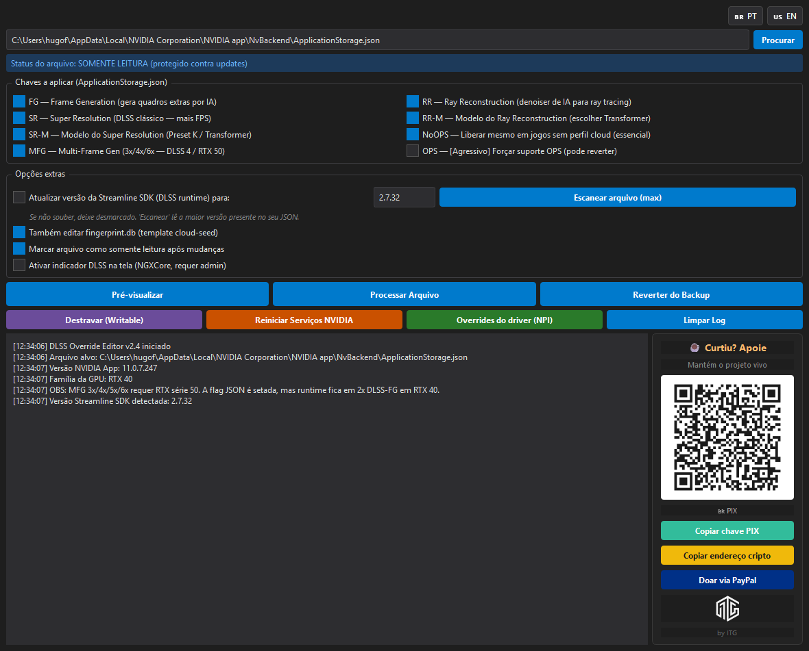

<div align="center">


# DLSS Override+

**Unlock DLSS 4 / Multi-Frame Generation / Transformer in *every* game with one click.**

A modernized fork of [DLSS Override For All Games](https://github.com/kaanaldemir/dlss-override-for-all-games),
rebuilt for the NVIDIA App 11.0.7+ era with full DLSS 4.5 support, fingerprint.db patching,
multi-language UI, and a bunch of safety nets.

[](https://github.com/innerthoughtgames/dlss-override-plus/releases)
[](LICENSE)
[](https://github.com/innerthoughtgames/dlss-override-plus/releases)
[](https://www.nvidia.com/en-us/software/nvidia-app/)
[](#-support-the-project)

[**⬇️ Download Latest**](https://github.com/innerthoughtgames/dlss-override-plus/releases/latest) •
[Quick Start](#-quick-start) •
[Features](#-features) •
[Star Citizen Tips](#-star-citizen--dlss-45-tuning) •
[FAQ](#-faq) •
[Support](#-support-the-project)



</div>

---

## ✨ Features

- 🇧🇷 / 🇺🇸 **Bilingual UI** — Portuguese and English, switchable at runtime via flag buttons
- ⚡ **DLSS 4 / DLSS 4.5 ready** — Unlocks Multi-Frame Generation (2x/3x/4x/6x), Transformer model, Ray Reconstruction
- 🔒 **Patches both files** — `ApplicationStorage.json` *and* `fingerprint.db` (so new games stay unlocked too)
- 🛡️ **Safe by default** — Hash-tracked backups, preview mode, read-only protection toggle, full revert
- 📊 **System probe** — Auto-detects NVIDIA App version + GPU family, warns about hardware-locked features
- 🎯 **Smart defaults** — Auto-fills Streamline SDK version from your existing JSON, no guessing
- 🔧 **NPI reference panel** — Documented driver-side hex IDs for users who want hardcore control
- ☕ **Bundled donation widget** — Inline PIX QR + crypto + PayPal buttons (no obnoxious popups)

## 🚀 Quick Start

```
1. Download DLSS_Override_Editor_v2.4.exe from Releases
2. Double-click to open
3. Click "Process File"  →  Click "Restart NVIDIA Services"
```

That's it. All your DLSS-capable games now have every override toggle unlocked in NVIDIA App.

## 📋 What it unlocks

Per-game flags flipped in `%LOCALAPPDATA%\NVIDIA Corporation\NVIDIA app\NvBackend\ApplicationStorage.json`:

| Key | Effect | Hardware needed |
|---|---|---|
| `Disable_FG_Override` → `false` | DLSS Frame Generation override | RTX 40 / 50 |
| `Disable_RR_Override` → `false` | DLSS Ray Reconstruction override | All RTX |
| `Disable_SR_Override` → `false` | DLSS Super Resolution override | All RTX |
| `Disable_RR_Model_Override` → `false` | RR model selection (Transformer) | All RTX |
| `Disable_SR_Model_Override` → `false` | SR model (Preset J / K / Transformer) | All RTX |
| `DLSS_Override_No_OPS` → `false` | Allow override without cloud OPS profile | — |
| `IsMultiGPUInferenceAllowed` → `true` | **Multi-Frame Generation 3x / 4x / 6x** | RTX 50 |
| `PinnedSLVersion` (optional) | Updates Streamline SDK pin per game | — |

Plus the same flags mirrored in `fingerprint.db` (the cloud-seed XML template).
Without that mirror, NVIDIA App would re-apply defaults on every newly fingerprinted game.

## 🖼️ Screenshots

<details>
<summary><b>Click to expand</b> — Portuguese UI / English UI</summary>


Flag toggle buttons at the top right switch the entire UI — labels, tooltips, status bar, and log messages — instantly.
The donation sidebar (right) shows an embedded PIX QR code and one-click copy buttons for PIX, crypto, and PayPal.

</details>

## 🎮 Star Citizen — DLSS 4.5 Tuning

The 2026 meta for Star Citizen, based on deep community testing (Reddit / Spectrum):

### With DLSS 4.5 DLLs (latest)

| Scenario | Preset | When to use |
|---|---|---|
| **DLAA (max native quality)** | **K** | RTX 4080 / 4090 — perfect anti-aliasing, pushes load to GPU to avoid the CPU bottleneck |
| **DLSS Quality / Performance** | **M** | When you need FPS — fixes the chronic ship-shimmering in distant objects |

### With older DLSS 3.7 / 3.8 DLLs

| Scenario | Preset | Note |
|---|---|---|
| Upscaling | **E** | Old gold standard — best motion clarity, controls ghosting |
| DLAA | **C** | Lowest absolute ghosting |

### `dlsstweaks.ini`

```ini
[DLSS]
ForceDLAA = true
OverrideAutoMultiple = true
OverrideAppId = true

[DLSSPresets]
DLAA = K        ; on v3.7 use C
Quality = M     ; on v3.7 use E
Performance = M
```

### In-game settings

- **Upscale Tech**: Transformer (not "Legacy")
- **Smooth Motion**: ON (requires Windows HAGS enabled)
- **V-Sync**: OFF — let monitor G-Sync handle it (reports of +30 FPS just from this change)

## ❓ FAQ

<details>
<summary><b>Is it safe? Will I get banned?</b></summary>

No. The tool only edits NVIDIA App's own config files on your local machine. It does not touch
game files, does not inject into any process, and is invisible to anti-cheat. The flags you flip
are the same ones NVIDIA App's UI flips — just on every game at once instead of one by one.

</details>

<details>
<summary><b>Does it work with any GPU?</b></summary>

Works on any RTX 20/30/40/50 card. Some features are hardware-locked at the driver level
regardless of what the JSON flags say:

- **MFG 3x/4x/6x** — RTX 50 only
- **DLSS-FG 2x** — RTX 40 and 50
- **Super Resolution + Ray Reconstruction** — all RTX cards

The tool sets the flags anyway. The runtime caps to what your hardware supports.

</details>

<details>
<summary><b>Do I need to run it on every boot?</b></summary>

No. Run it once, it sticks. Only re-run when:
- You install a new game (NVIDIA App can't fingerprint it while the file is read-only)
- NVIDIA App updated and your changes were reset (the tool detects this via SHA-256)

</details>

<details>
<summary><b>I installed a new game — what now?</b></summary>

1. Open DLSS Override+
2. Click **Make Writable**
3. Open NVIDIA App, let it detect the new game
4. Back in DLSS Override+, click **Process File**
5. Click **Restart NVIDIA Services**

</details>

<details>
<summary><b>Antivirus flagged the .exe</b></summary>

Common false positive with PyInstaller-bundled Python. The source code is fully visible in this
repo — you can run it directly from `python "DLSS Override+.py"` if you prefer (requires
`PyQt6`). Alternatively, build your own .exe (instructions below).

</details>

<details>
<summary><b>What about driver-side overrides (Preset K, MFG multiplier)?</b></summary>

Those live in the driver profile database, not in `ApplicationStorage.json`. Use
[nvidiaProfileInspector](https://github.com/Orbmu2k/nvidiaProfileInspector) with these IDs:

| Hex ID | Setting | Values |
|---|---|---|
| `0x104D6667` | DLSS-MFG Fixed Frame Generation Count | 0=N/A, 1=2x, 2=3x, 3=4x, 4=5x, 5=6x |
| `0x10562D0F` | DLSS-MFG Dynamic Frame Generation Count | 0=N/A, 2=Up to 2x, 3=3x, ..., 6=6x |
| `0x10E41DF3` | DLSS-SR Forced Preset Letter | 5=E, 6=F, 0xA=J, 0x00FFFFFF=K (DLSS 4) |
| `0x10E41DF4` | DLSS-SR Force all levels to DLAA | 0=Off, 1=On |
| `0x10E41DF7` | DLSS-RR Forced Render Preset | preset selector |

The in-app **"Driver-side overrides (NPI)"** button shows the full table.

</details>

## 🛠️ Building from source

```bash
git clone https://github.com/innerthoughtgames/dlss-override-plus.git
cd dlss-override-plus
pip install PyQt6 pyinstaller qrcode[pil]

# Run directly
python "DLSS Override+.py"

# Or build a .exe
python -m PyInstaller --clean --noconfirm DLSS_Override_Editor.spec
# Output: dist/DLSS_Override_Editor_v2.4.exe
```

## 🏗️ How it works

NVIDIA App stores its per-game DLSS state in two synchronized files:

1. **`ApplicationStorage.json`** — Live state, one entry per detected game. Driver reads this to decide which override toggles to show in the UI.
2. **`fingerprint.db`** — XML cloud-seed template. NVIDIA App uses this to populate a game's initial state when it's fingerprinted for the first time.

This tool patches **both** so that:
- Existing games immediately get the override toggles
- New games auto-detected later also start with overrides enabled

It then optionally locks `ApplicationStorage.json` as read-only to prevent NVIDIA App from
silently reverting your changes when it syncs with NVIDIA's cloud profile DB.

## 📂 Project structure

```
.
├── DLSS Override+.py            # Main app (PyQt6)
├── DLSS_Override_Editor.spec    # PyInstaller build config
├── COMO_USAR.html               # End-user guide (bilingual PT/EN)
├── README.md                    # This file
├── LICENSE                      # MIT
├── itg.ico / itg.png            # App icons
├── screenshot_app.png           # Main UI screenshot
├── qr_bep20.png                 # Donation QR — BSC/BEP20
├── qr_pix.png                   # Donation QR — Brazilian PIX
└── qr_paypal.png                # Donation QR — PayPal
```

## ☕ Support the project

This program is free and will stay free. If it helped and you want to support continued
development, any amount is appreciated.

### 💎 Crypto — BNB Smart Chain (BEP20)

Same wallet for USDT, USDC, BTCB/WBTC, BUSD, or any BEP20 token:

```
0x724ec14cbfabdf7bb07653bd73298ca1a4730ffb
```


> ⚠️ **Warning:** Only accepts the **BSC / BEP20** network. Do not send native Bitcoin
> (addresses starting with `bc1`, `1`, or `3`) — funds will be lost. Use BTCB (Bitcoin wrapped
> on BSC) instead.

### 🇧🇷 PIX (Brazil — instant, no fees)

Random key:

```
8cd6bf4a-6288-4535-a5fd-78dce11e3568
```


### 💸 PayPal (international, credit card)

[](https://www.paypal.com/donate/?business=47E2WRE9G99U2&currency_code=BRL)


## 🙏 Credits

- **[Kaan Aldemir](https://github.com/kaanaldemir)** — original [DLSS Override For All Games](https://github.com/kaanaldemir/dlss-override-for-all-games) that this fork is built on
- **[JPersson77](https://gist.github.com/JPersson77/91a5c53af55104a2bfc5c9be32118203)** — the PowerShell prior art that documented the `fingerprint.db` mirror trick
- **[Orbmu2k](https://github.com/Orbmu2k/nvidiaProfileInspector)** — nvidiaProfileInspector + the driver-side hex IDs documented in our NPI panel
- **[emoose](https://github.com/emoose/DLSSTweaks)** — DLSSTweaks, the DLL-injection layer that pairs nicely with this JSON-side tool
- **NVIDIA** — for shipping a UI that defaults to "off" and giving us a reason to exist

## 📄 License

[MIT](LICENSE) — see file for full text. Original copyright belongs to Kaan Aldemir;
modifications and additions © 2026 Inner Thought Games.

---

<div align="center">

**Made with ☕ by [Inner Thought Games](https://github.com/innerthoughtgames)**

</div>
